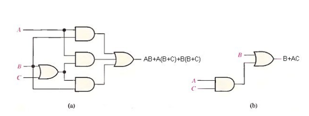

# Theory:

A simplified Boolean expression uses the fewest gates possible to implement a given expression. 

Example Using Boolean algebra techniques, simplify this expression: 

$$ AB + A(B + C) + B(B + C) $$

Solution:

1. ***Step 1:*** Apply the distributive law to the second and third terms in the expression, as follows: 

 $$ A B + A B + A C + B B  + B C $$ 

2. ***Step 2:*** Apply rule 7 (BB = B) to the fourth term. 

 $$ AB + AB + AC + B + BC $$

3. ***Step 3:*** Apply rule 5 (AB + AB = AB) to the first two terms. 

 $$ AB + AC + B + BC $$

4. ***Step 4:*** Apply rule 10 (B + BC = B) to the last two terms. 

 $$ AB + AC + B $$

5. ***Step 5:*** Apply rule 10 (AB + B = B) to the first and third terms. 

 $$ B+AC $$ 

At this point the expression is simplified as much as possible.

