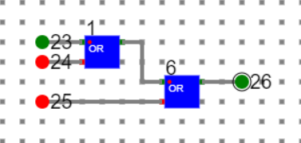
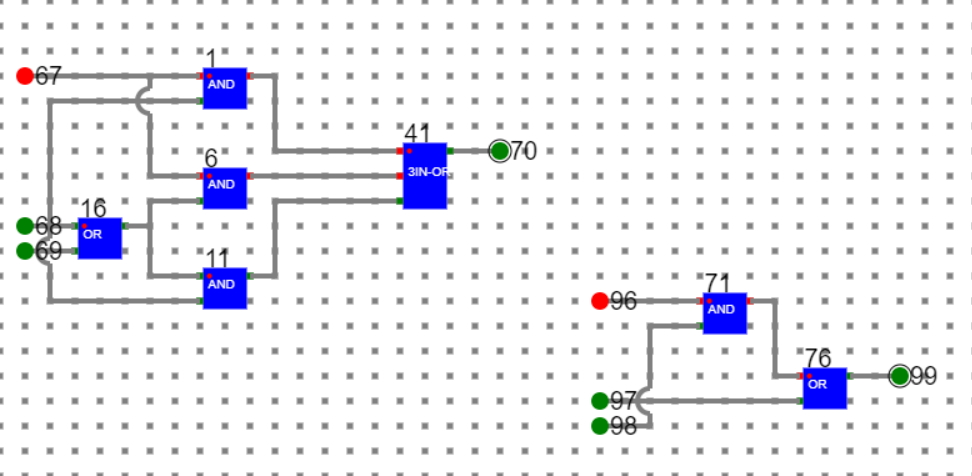

# Procedure

- To draw any diagram in the simulator please follow the manual given in manual section.
	   
- In theory section we have simplified **eq1: AB+A(B+C)+B(B+C)** into **eq2: B+AC**.
- Let’s design both the Boolean Expressions in the simulator and test as below.
		
- **Step1.** We need a three input ‘OR’ gate which is not available in the simulator. So we have to first make a 3 input ‘OR’ gate with the basic gates available.
 
 

 
 

- Above circuit is a 3 input ‘OR’ design with 2 basic ‘OR’ gates.
- Let’s save it as a component with some name say ‘3IN-OR’

- **Step2.** Now design eq1 and eq2 as shown below.
    - **Eq1** has been designed with the help of basic 2 input ‘AND’, 2 input ‘OR’ and the 3 input ‘OR’ gate developed in step 1.
    - **Eq2** has been designed with the help of basic 2 input ‘AND’ and 2 input ‘OR’ gate.
 
 

 
 

where

**67, 96: A**

**68, 97: B**

**69, 98: C**

**70, 99: Output**

- Both circuits give the same output for same combination of inputs.

# Manual
- Follow the below manual and perform the experiment
    - Manual --> [Click Here](./simulation/coavlNew.pdf)

<embed src="./simulation/coavlNew.pdf" type="application/pdf">

